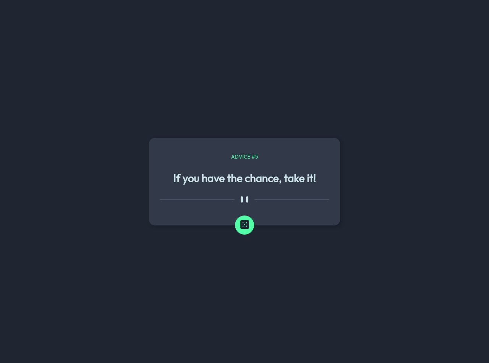

# Frontend Mentor - Advice generator app solution

This is a solution to the [Advice generator app challenge on Frontend Mentor](https://www.frontendmentor.io/challenges/advice-generator-app-QdUG-13db). Frontend Mentor challenges help you improve your coding skills by building realistic projects.

## Table of contents

- [Frontend Mentor - Advice generator app solution](#frontend-mentor---advice-generator-app-solution)
  - [Table of contents](#table-of-contents)
  - [Overview](#overview)
    - [The challenge](#the-challenge)
    - [Screenshot](#screenshot)
    - [Links](#links)
  - [My process](#my-process)
    - [Built with](#built-with)
  - [Author](#author)

## Overview

### The challenge

When loading the page, a phrase will be displayed as the result of an API query, just like when the button below is clicked.

### Screenshot

### Links

- Live Site URL: [Advice App API](https://advice-app-api.netlify.app)

## My process

### Built with

- Semantic HTML5 markup
- CSS custom properties
- Flexbox
- [Advice Slip Json API](https://api.adviceslip.com/)

## Author

- Telegram - [@cmglezpdev](https://t.me/cmglezpdev)
- Frontend Mentor - [@cmglezpdev](https://www.frontendmentor.io/profile/cmglezpdev)
- Twitter - [@cmglezp](https://www.twitter.com/CMGlezP)
